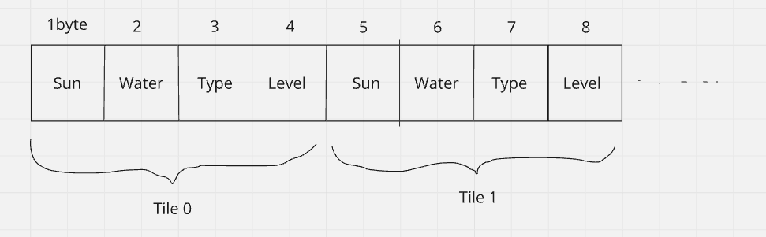

# Devlog Entry - [2024/11/22]

## Introducing the Team
**Tools Lead**: **Hengyang Ye**

**Engine Lead**: **Hengyang Ye**, **Ray Wang**

**Design Lead**: **Ray Wang**

---

## Tools and Materials

### Engines, Libraries, Frameworks, and Platforms:
-Phaser3, Typescript, Html5

We Choose to use Phaser3 framework because it is more familiar to us. 

We Choose Typescript instead of Javascript because TS is a superset of JS.

### Programming and Data Languages:
- Our project will primarily use **TypeScript** for the game logic. For styling, we will use **CSS**. JSON may be used for data storage and exchange between systems.  

### Authoring Tools:
- **Visual Studio Code (VS Code)**: Our IDE for coding.  
- **Git**: Version control to manage our code and collaborate effectively.    

### Alternate Platform:
- If Phaser3 does not work well in the project, We will use Godot instead.

---

## Outlook
- We wish to learn the implementation of a SAVE & LOAD system for game, and the Internal and External DSLs.

## How we satisfied the software requirements

### F0
- f0.a: The player can control a yellow square as the character, using arrow keys to move over a 5*5 2D grid.
- f0.b: The player can clicked the 'next day' button to start the next day. For each day, the player has 10 actions(Plant or Harvest will use an action).
- f0.c: When the player steps on a grid, then the grid the highlighted and he can interact with that grid.
- f0.d: The grid will show it's sun and water level. For each day the sun and water will randomly generated. The sun level will can not accumulate, but the water level can.(Sun: 0-100, Water(Current level + 0-30).
- f0.e: There is 3 crops, potato, carrot, and cabbage. Each of them has 3 growth level.
- f0.f: If the sun and water level of current grid fit the requirement of growth, the plant will grow, upgrade to next level.
- f0.g: The player will unlock achievements if he get a decent number of crops.
  
- f1.a: The game's grid state is stored in a single contiguous byte array.
  We implemented this using an Array of Structures (AoS) format. Each cell is represented by 4 bytes:

  Byte 0: Sunlight (0–100)
  
  Byte 1: Water (0–100)
  
  Byte 2: Plant Type (0 = none, 1 = potato, 2 = carrot, 3 = cabbage)
  
  Byte 3: Plant Level (0–3, 0 means no plant)
  
  This yields a layout like this:
    [Cell0:Sun,Water,Type,Level][Cell1:Sun,Water,Type,Level]...[CellN:Sun,Water,Type,Level]

  

  Thus, (row * GRID_SIZE + col)*4 gives the starting index for a cell. We chose AoS because it keeps all data for a single tile adjacent, making it straightforward to update and display each tile.
  
- f1.b: We serialize dayCount, inventory, achievements, actionsRemaining, gridData, and now also undoStack/redoStack into JSON and store them in localStorage. The player can choose a slot to save and load from.

- f1.c: After major actions (e.g. end of day, planting, harvesting), we auto-save the current state into localStorage under a special autoSave key. On next startup, if autoSave is found, the player can choose to continue from that state.

-f1.d: We maintain two stacks: undoStack and redoStack. Before any major state change, we push the current state onto undoStack. Undo pops from undoStack and pushes onto redoStack, reverting to a previous state. Redo pops from redoStack and pushes to undoStack, moving forward again. These stacks are also saved and loaded, so after loading a game, the player can still undo/redo previous actions.

## Reflection
We found that Phaser is enough for our needs, so there is no big changes. However, we somehow changed our roles. Hengyang Ye did the overall design of the game, and I Implement most of the code.

Implementing F1 made us consider how the player's interaction with the game’s timeline evolves. Previously, we only tracked current state, but now we manage historical states for undo/redo. We needed a more careful approach to serialization, ensuring undoStack and redoStack were saved and restored properly.
